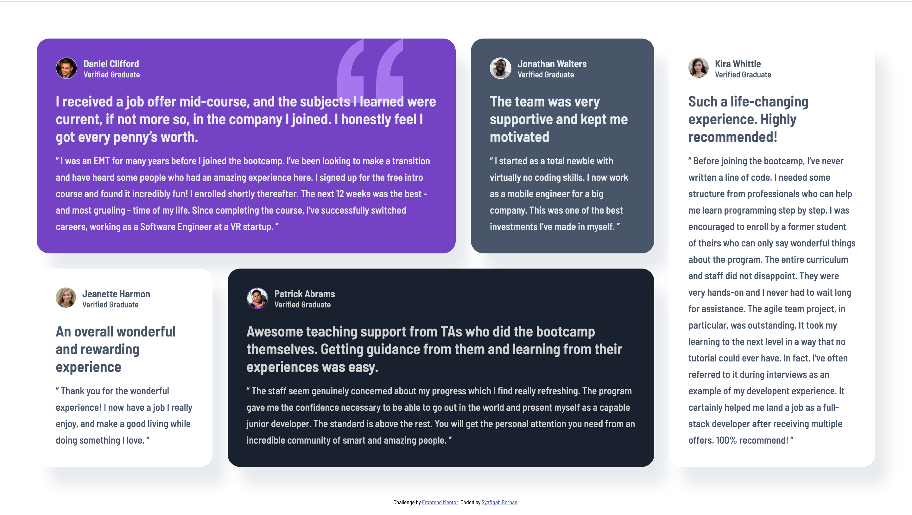

# testimonials-display-card

This is a project chalenge from Frontend Mentor online. The challenge is to code so that the webpage is similar to the design provided.

# Frontend Mentor - Testimonials grid section solution

This is a solution to the [Testimonials grid section challenge on Frontend Mentor](https://www.frontendmentor.io/challenges/testimonials-grid-section-Nnw6J7Un7). Frontend Mentor challenges help you improve your coding skills by building realistic projects.

## Table of contents

- [Overview](#overview)
  - [The challenge](#the-challenge)
  - [Screenshot](#screenshot)
  - [Links](#links)
- [My process](#my-process)
  - [Built with](#built-with)
  - [What I learned](#what-i-learned)
  - [Continued development](#continued-development)
- [Author](#author)
- [Acknowledgments](#acknowledgments)

**Note: Delete this note and update the table of contents based on what sections you keep.**

## Overview

### The challenge

Users should be able to:

- View the optimal layout for the site depending on their device's screen size

### Screenshot



### Links

- Solution URL: [https://github.com/cosylily/testimonials-display-card.git]
- Live Site URL: [https://amazing-syrniki-c95488.netlify.app/]

## My process

### Built with

- HTML
- CSS

### What I learned

Used short hand flex in flexbox for the first time instead of settling to using display grid which is no fun. Had a blast with flexbox in this project, literally used flex whenever, whereever I can.

```css
.proud-of-this-css {
  flex: 3;
}
```

### Continued development

I would like to be able to use vw or vh for margins and what not so that responsive settings will be simple.

## Author

- Website - [https://syafiqahborhan.netlify.app/]
- Frontend Mentor - [@cosylily](https://www.frontendmentor.io/profile/cosylily)

## Acknowledgments

I would like to give credit to the person who simplified the concept of box-shadow to me in one of the challenge so that I cam able to experiment it myself.
